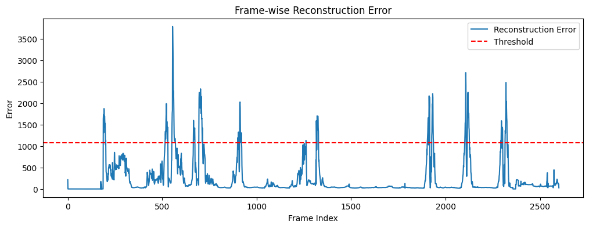

# Shopformer: Shoplifting Detection via Human Pose

Anomaly detection system for shoplifting or unusual human behavior using 2D human pose keypoints.  
This project is based on:

**[PoseLift JSON dataset](https://github.com/TeCSAR-UNCC/PoseLift)** – contains human skeleton keypoints per frame (`x, y, confidence`)  
**PoseNet Autoencoder** – trained to reconstruct normal human poses  
**Anomaly Detection** – uses reconstruction error to flag unusual behavior (possible shoplifting)

A PyTorch implementation of the Shopformer model for detecting shoplifting activities in videos using human pose estimation, based on the research paper ["Shopformer: Transformer-Based Framework for Detecting Shoplifting via Human Pose"](https://arxiv.org/pdf/2504.19970).

## 📋 Overview

This project implements a transformer-based framework that analyzes human pose sequences to detect potential shoplifting behaviors in retail environments. The model processes 2D human pose keypoints extracted from video frames to identify suspicious activities.

## 🏗️ Architecture

### Current Implementation
- **Pose Data Processing**: Handles JSON-formatted pose keypoints from PoseLift dataset
- **Autoencoder-style Pose Network**: Basic feedforward network for pose reconstruction
- **Training Pipeline**: Complete training workflow with MSE loss

### Planned Shopformer Components
- Transformer encoder for temporal sequence modeling
- Multi-head attention for capturing spatial relationships between joints
- Classification head for shoplifting detection
- Sequence processing for temporal dynamics

## 📁 Project Structure
```
shopformer/
├── train.ipynb # Main training script
├── pose_model.pth # Trained model weights
└── pose/
  ├── train/ # Training pose data
  └── test/ # Testing pose data
└── data/
```

## 📊 Dataset
The model uses the PoseLift dataset containing:
- 2D human pose keypoints extracted from video frames
- JSON format with person IDs and frame sequences
- Keypoints format: [x1, y1, x2, y2, ..., x17, y17] (17 body joints)

```
{
  "person_id": {
    "frame_id": {
      "keypoints": [x1, y1, c1, x2, y2, c2, ...]
    }
  }
}
```

## 📈 Training
The model is trained as an autoencoder:
- Objective: Reconstruct input pose sequences
- Batch Size: 32
- Learning Rate: 1e-3
- Optimizer: Adam
- Loss: MSE between input and reconstructed poses


## 📋 Output

*Frame-wise Reconstruction Error*

- Average reconstruction error: 236.9241
- Highest error: 3783.0017
- Lowest error: 1.8848


*Shoplifting Detected*


## How to run
1. Create environment & install dependencies
   
  ```
  python3 -m venv venv
  source venv/bin/activate
```

2. Train PoseNet on PoseLift data
```
Run each cell of train.ipynb sequentially
```

3. Visualize anomalies on video
```
Run anomaly detection for video1 and video2
```

## Output Files Generated

- output_anomalies.mp4 :	Video with red alert on anomalous frames
- anomaly_timestamps.csv	: Frame number, timestamp, reconstruction error
- posenet.pth :	Trained weights

## Report
Access Report here [Shopformer Implementation Report](https://github.com/anushka24agarwal/Shoplifting-Detection/blob/main/Report.pdf)
